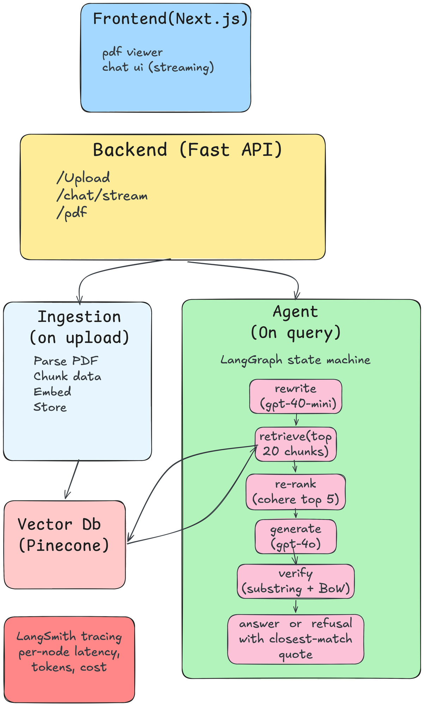

# PDF Agent

Chat with a PDF. Every answer cites the exact page and a verbatim quote. If the answer isn't in the document, the agent refuses and points to the closest related passage.



## Run it

```sh
cp .env.example .env       # fill in OPENAI_API_KEY and PINECONE_API_KEY
uv sync                    # backend deps
cd ui && npm install && cd ..   # frontend deps

make api    # FastAPI on :8000
make ui     # Next.js on :3000
```

Open http://localhost:3000.

## Eval

```sh
make eval     # 11 queries, binary pass/fail
make ragas    # Ragas metrics
```

Latest run on `data/sample.pdf`:

```
Binary suite     11/11 pass   (5 valid + 3 OOS + 3 multilingual)

Ragas (n=8)
  faithfulness        0.948
  context_precision   0.951
  context_recall      1.000
```

## Layout

```
app/    backend (FastAPI, LangGraph agent, Pinecone, OpenAI)
ui/     Next.js 15 frontend (PDF viewer + streaming chat)
evals/  binary suite + Ragas
data/   sample.pdf
```

## Deploy

`render.yaml` ships a two-service Render blueprint (API + UI, both free tier).
See [`DEPLOYMENT.md`](DEPLOYMENT.md) for the step-by-step.

## Read more

- [`TECHNICAL_NOTE.md`](TECHNICAL_NOTE.md) — architecture, decisions, trade-offs
- [`TEST_INSTRUCTIONS.md`](TEST_INSTRUCTIONS.md) — what to try, eval reproduction
- [`DEPLOYMENT.md`](DEPLOYMENT.md) — Render deploy in 5 steps
