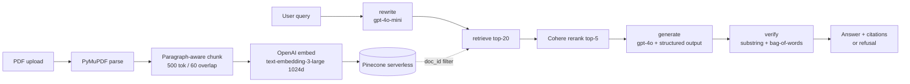

# PDF Agent

Chat with a PDF. Every answer cites the exact page and a verbatim quote from the source. Out-of-scope questions are refused with a pointer to the closest related passage.

## Quick start

```sh
cp .env.example .env
# Fill in OPENAI_API_KEY and PINECONE_API_KEY (Cohere + LangSmith are optional).

uv sync
cd ui && npm install && cd ..

make api      # FastAPI  → http://localhost:8000
make ui       # Next.js  → http://localhost:3000
```

Open http://localhost:3000, upload a PDF, ask questions.

## What's in here

| Path | What |
|---|---|
| `app/` | Backend: FastAPI, LangGraph agent, Pinecone client |
| `ui/` | Next.js 15 frontend with PDF viewer + streaming chat |
| `evals/` | Binary pass/fail suite + Ragas metrics |
| `data/sample.pdf` | The assignment brief used as the test corpus |
| `TECHNICAL_NOTE.md` | Architecture, decisions, trade-offs |
| `TEST_INSTRUCTIONS.md` | How to run and what to try |

## How it works



Five-node LangGraph agent: **rewrite → retrieve → rerank → generate → verify**. The verifier rejects any answer whose citations don't appear verbatim in the retrieved chunks (after whitespace/hyphenation normalisation), replacing it with a refusal that points to the closest retrieved passage.

Streaming: token-by-token over SSE. The frontend uses `partial-json` to parse the growing JSON object as it arrives.

## Eval

```sh
make eval     # 11 queries, binary pass/fail (~90s)
make ragas    # Ragas faithfulness / precision / recall (~3min)
```

Latest run on `data/sample.pdf`:

```
Binary suite     11/11 pass (5 valid + 3 OOS + 3 multilingual)

Ragas (n=8)
  faithfulness        0.948
  answer_relevancy    0.533   (judge LLM returns n=1 instead of n=3 — high variance)
  context_precision   0.951
  context_recall      1.000
```

## Stack

Python · FastAPI · LangGraph · OpenAI (`gpt-4o`, `gpt-4o-mini`, `text-embedding-3-large`) · Pinecone · Cohere `rerank-3.5` · LangSmith · PyMuPDF · Next.js 15 · react-pdf · Tailwind

## Read more

- `TECHNICAL_NOTE.md` for the why behind every choice
- `TEST_INSTRUCTIONS.md` for the test queries and reproduction steps
